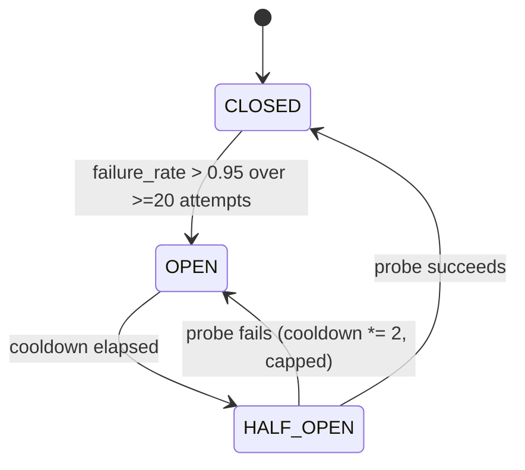
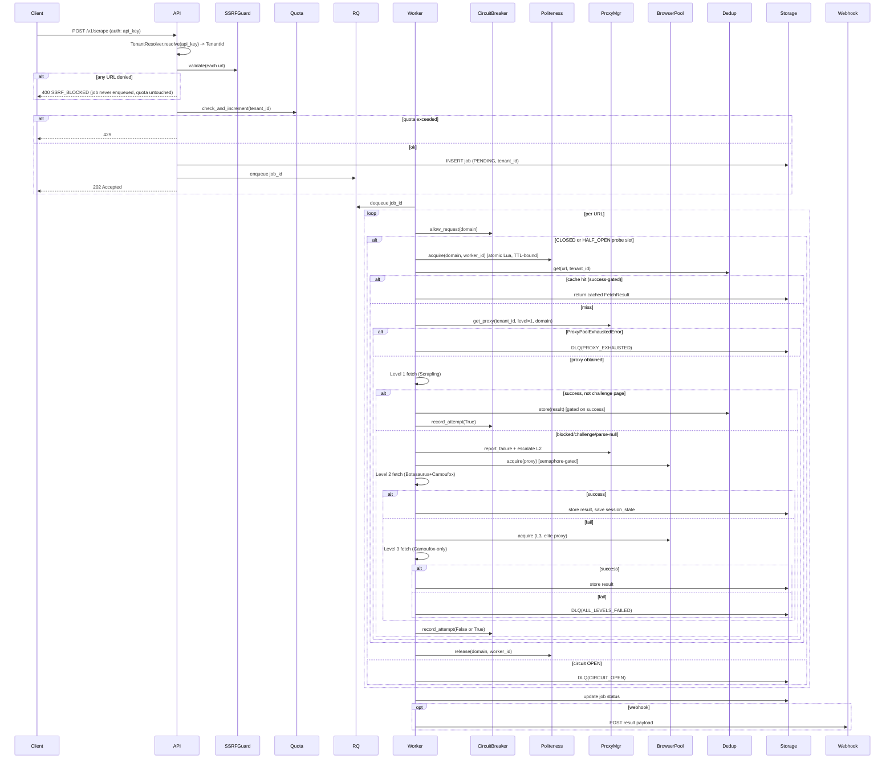

# Search & Scraper Engine — Implementation-Grade Blueprint v2.0
### Post-Audit Corrected Specification — Internal Engineering Use Only

This document supersedes v1.0. Every defect identified in the adversarial audit (F-01 through F-32) is closed here by construction. Where v1.0 asserted a fact without verifying it, this document either verifies it against the actual library surface or marks it a **BLOCKING DEPENDENCY** requiring a decision before implementation starts. Nothing below is aspirational; every code artifact is meant to be copy-implementable.

---

## 0. Blocking Dependencies — ALL RESOLVED (2026-07-21)

| ID | Dependency | Decision | Impact on spec |
|---|---|---|---|
| BD-01 | Free proxy source list | Verify `proxifly`, `proxyscrape`, `iplocate`, `proxripper` are live before implementation. If any dead/unusable, find alternatives at that time. | No change — defaults remain as spec'd. |
| BD-02 | Camoufox binary distribution | Bake Camoufox into Docker image at build time. Accept larger image for instant startup + no runtime download failures. | Binary-not-found failure mode (§3.4) becomes unreachable; keep the error message as a safety net. |
| BD-03 | CapSolver spending ceiling | **$1.00/day** hard ceiling enforced in `core/budget.py`. | Change `capsolver_daily_credit_ceiling` default from `5.0` → `1.0`. |
| BD-04 | Tenant provisioning | Built into the scraper system. Admin endpoints create tenants and generate API keys internally. `core/tenant.py` validator is the only gate. | No change — spec already designed `api_keys` table as resolution point. |
| BD-05 | Regression test targets | Self-hosted Cloudflare-challenge-page mirror for `tests/live/` anti-detection validation (per spec recommendation). | No change — spec §10 already assumes this. |
| BD-06 | Postgres connection sizing | `max_client_conn = 500`, `default_pool_size = 20` (per spec recommendation). Tunable for future scaling. | No change — spec §3.10 values confirmed. |
| BD-07 | HTML snapshot retention | Failed snapshots: retain 30 days. Successful snapshots: retain 1 day. Automated deletion scheduled in `storage/s3_client.py`. | New requirement — add lifecycle policy to S3 client. |

---

## 1. System Overview

### 1.1 Design Invariants (non-negotiable, enforced in code, not just convention)

1. **No component ever calls a proxybroker2 HTTP control API** — it doesn't exist (verified against upstream docs/README). All proxy state lives in *our* Postgres/Redis, populated by a harvester we own.
2. **No component hand-rolls fingerprint spoofing.** Camoufox's `AsyncCamoufox` launcher owns 100% of fingerprint/geoip/UA/canvas/WebGL surface. Application code never touches `navigator`, `WebGL*`, or `Canvas*` prototypes.
3. **`tenant_id` is never read from an ambient `ContextVar` at a trust boundary.** It is an explicit, validated `TenantId` value object threaded through every function signature that touches storage, queue, or proxy state. ContextVar is permitted *only* for log enrichment.
4. **Every outbound fetch target is SSRF-checked before enqueue and re-checked after every redirect hop.**
5. **Nothing is cached as "successful content" unless `FetchResult.success is True` and the response is not a classified challenge/interstitial page.**
6. **Every resource acquisition (browser process, proxy lease, politeness slot, CapSolver task) is bounded by an explicit ceiling and has a guaranteed release path (context manager or TTL), never both together for the same resource ("guaranteed release" is the primary path; TTL is the deadman's switch).**
7. **All SQL identifiers (schema names, table names built from variables) are validated against a strict allow-list regex before interpolation; there is no other path to constructing DDL/DSN strings.**

### 1.2 Directory Structure (complete)

```text
project/
├── core/
│   ├── __init__.py
│   ├── tenant.py                  # TenantId value object, resolution, validation
│   ├── models.py                  # Shared Pydantic domain models
│   ├── exceptions.py              # Exception hierarchy
│   ├── retry.py                   # Category-aware retry/backoff strategy objects
│   ├── ssrf_guard.py               # URL/IP destination validation
│   ├── budget.py                  # Global semaphores + spend ceilings
│   ├── quota.py                   # Per-tenant daily quota (Redis counter)
│   └── clock.py                   # Injectable time source (testability)
├── proxy/
│   ├── harvester.py                # Background proxy discovery (owns proxybroker2 Python API calls)
│   ├── manager.py                  # Proxy selection from our own scored pool
│   ├── scoring.py                  # Multi-dimensional proxy scoring
│   ├── lease.py                    # Sticky lease (heartbeat + safety TTL)
│   └── health_monitor.py           # Periodic re-validation of pooled proxies
├── browser/
│   ├── camoufox_wrapper.py         # Thin adapter over camoufox.async_api.AsyncCamoufox
│   ├── pool.py                     # Semaphore-bounded pre-warmed pool
│   └── session_state.py            # Cookie/localStorage/storage_state persistence helpers
├── fetcher/
│   ├── result.py                   # FetchResult contract shared by all levels
│   ├── level_1.py                  # Scrapling (HTTP) + Firecrawl markdown
│   ├── level_2.py                  # Botasaurus + Camoufox (sticky proxy)
│   ├── level_3.py                  # Camoufox-only (nuclear)
│   ├── scrapling_wrapper.py
│   ├── adaptive_selector.py
│   ├── botasaurus_wrapper.py
│   └── challenge_detector.py       # Heuristic classifier: is this HTML a block/challenge page?
├── services/
│   ├── firecrawl_client.py
│   ├── capsolver.py
│   └── scrapy_adapter.py
├── storage/
│   ├── postgres_client.py          # PgBouncer-fronted pool, tenant-scoped via SET search_path per checkout
│   ├── redis_client.py             # Tenant-prefixed key wrapper
│   ├── s3_client.py
│   ├── dedup.py                    # Success-gated content cache
│   ├── session_manager.py
│   ├── fingerprint_store.py        # Persists Camoufox `storage_state`/config references, not hand-built fingerprints
│   └── dlq.py
├── orchestrator/
│   ├── worker.py                   # RQ task definition, execution loop, state machine driver
│   ├── politeness.py               # Atomic (Lua) concurrency + delay controller
│   ├── circuit_breaker.py          # 3-state (closed/open/half-open)
│   └── webhook.py
├── api/
│   ├── main.py
│   ├── routes.py
│   ├── dependencies.py
│   ├── auth.py                     # API-key → TenantId resolution (single point of tenant trust)
│   └── health.py
├── cli/
│   └── entrypoint.py
├── config/
│   ├── schema.py
│   ├── loader.py
│   ├── base.yaml
│   ├── production.yaml
│   └── staging.yaml
├── observability/
│   ├── metrics.py                  # Prometheus, WIRED into every call site (not just declared)
│   ├── logging.py
│   └── tracing.py
├── scrapy_project/
│   ├── spiders/
│   ├── middlewares/
│   ├── pipelines/
│   ├── settings.py
│   └── addons.py
├── monitoring/
│   ├── dashboards/
│   └── alerts/
├── infra/
│   └── pgbouncer/
│       └── pgbouncer.ini
├── tests/
│   ├── unit/
│   ├── integration/
│   ├── chaos/                      # F-14/F-23/F-06-style resource-exhaustion & race tests
│   └── live/                       # ONLY against owned/consented targets (BD-05)
├── docker-compose.yml
└── pyproject.toml
```

### 1.3 Component Ownership Matrix

| Module | Owns | Never Does |
|---|---|---|
| `proxy/harvester.py` | Discovering, validating, scoring, and persisting proxies | Never called synchronously from a request path |
| `proxy/manager.py` | Selecting a proxy from the persisted pool for a given request | Never talks to proxybroker2 directly |
| `browser/camoufox_wrapper.py` | Launching a fingerprint-consistent browser | Never sets `navigator`/`WebGL`/`Canvas` properties manually |
| `core/tenant.py` | Validating and typing tenant identity | Never trusts client-supplied free-text tenant names |
| `core/ssrf_guard.py` | Deciding if a URL is safe to fetch | Never runs after the fetch has started (must gate *before*) |
| `storage/dedup.py` | Caching successful content only | Never caches based on raw byte hash alone |

---

## 2. Core Domain Models

```python
# core/models.py
from __future__ import annotations
from pydantic import BaseModel, HttpUrl, Field, field_validator
from typing import Optional, List, Dict, Any
from enum import Enum
from datetime import datetime

class SessionType(str, Enum):
    ASYNC = "async"
    STEALTHY = "stealthy"
    DYNAMIC = "dynamic"

class ProxyProtocol(str, Enum):
    HTTP = "HTTP"
    HTTPS = "HTTPS"
    SOCKS4 = "SOCKS4"
    SOCKS5 = "SOCKS5"

class AnonymityLevel(str, Enum):
    TRANSPARENT = "transparent"
    ANONYMOUS = "anonymous"
    ELITE = "elite"

class AsnClass(str, Enum):
    DATACENTER = "datacenter"
    RESIDENTIAL = "residential"
    MOBILE = "mobile"
    UNKNOWN = "unknown"

class Proxy(BaseModel):
    id: int
    ip: str
    port: int
    protocol: ProxyProtocol
    anonymity_level: AnonymityLevel = AnonymityLevel.TRANSPARENT
    asn_class: AsnClass = AsnClass.UNKNOWN
    reliability_score: float = Field(ge=0, le=100, default=50.0)

    def url(self) -> str:
        return f"{self.protocol.value.lower()}://{self.ip}:{self.port}"

    def key(self) -> str:
        return f"{self.ip}:{self.port}"

class FailureCategory(str, Enum):
    NETWORK_TIMEOUT = "network_timeout"
    DETECTION_BLOCK = "detection_block"
    BROWSER_CRASH = "browser_crash"
    CAPTCHA_TRIGGERED = "captcha_triggered"
    PARSE_ERROR = "parse_error"
    PROXY_EXHAUSTED = "proxy_exhausted"
    CIRCUIT_OPEN = "circuit_open"
    SSRF_BLOCKED = "ssrf_blocked"
    QUOTA_EXCEEDED = "quota_exceeded"

class FetchResult(BaseModel):
    url: str
    success: bool
    http_status: Optional[int] = None
    is_challenge_page: bool = False
    html: Optional[str] = None
    markdown: Optional[str] = None
    extracted: Optional[Dict[str, Any]] = None
    level_used: int
    failure_category: Optional[FailureCategory] = None
    error_message: Optional[str] = None
    proxy_used: Optional[str] = None
    duration_ms: int
    fetched_at: datetime = Field(default_factory=datetime.utcnow)

class ConfigOverrides(BaseModel):
    max_retries: int = 3
    extraction_mode: str = "standard"          # standard | exhaustive
    timeout_seconds: int = 120
    respect_robots: bool = False
    include_tags: Optional[List[str]] = None
    exclude_tags: Optional[List[str]] = None
    extraction_schema: Optional[Dict[str, Any]] = None

class ScrapeRequest(BaseModel):
    urls: List[HttpUrl]
    config_overrides: Optional[ConfigOverrides] = None
    async_mode: bool = True
    webhook: Optional[HttpUrl] = None

    @field_validator("urls")
    @classmethod
    def non_empty(cls, v):
        if not v:
            raise ValueError("urls must contain at least one entry")
        if len(v) > 500:
            raise ValueError("max 500 urls per job; use /v1/crawl for larger sets")
        return v

class JobStatus(str, Enum):
    PENDING = "PENDING"
    PROCESSING = "PROCESSING"
    COMPLETED = "COMPLETED"
    FAILED = "FAILED"
    CANCELLED = "CANCELLED"
    DEAD_LETTER = "DEAD_LETTER"

class JobStatusResponse(BaseModel):
    job_id: str
    status: JobStatus
    progress: Optional[float] = None
    results: Optional[List[FetchResult]] = None
    error: Optional[str] = None
```

```python
# core/tenant.py
import re
from pydantic import GetCoreSchemaHandler
from pydantic_core import core_schema

_TENANT_RE = re.compile(r"^[a-z][a-z0-9_]{2,62}$")

class TenantId(str):
    """
    The ONLY type accepted at any storage/proxy/queue boundary.
    Construction is the single validation gate (F-10, F-11, F-31 closure).
    Raises ValueError on anything that isn't a safe SQL-identifier-shaped string.
    """
    def __new__(cls, value: str) -> "TenantId":
        if not isinstance(value, str) or not _TENANT_RE.match(value):
            raise ValueError(f"invalid tenant_id: {value!r}")
        return super().__new__(cls, value)

    @classmethod
    def __get_pydantic_core_schema__(cls, source_type, handler: GetCoreSchemaHandler):
        return core_schema.no_info_after_validator_function(cls, handler(str))
```

---

## 3. Component Specifications

Each subsystem below follows the fixed template: Responsibilities → Interface → Lifecycle → State/Concurrency → Failure Modes → Recovery → Observability → Config → Testing → Security → Performance → Extensibility.

### 3.1 `core/ssrf_guard.py`

**Responsibilities:** Reject any scrape target resolving to a non-public network destination, at enqueue time and after every redirect.

**Interface:**
```python
class SSRFGuard:
    DENIED_NETWORKS = [
        "127.0.0.0/8", "10.0.0.0/8", "172.16.0.0/12", "192.168.0.0/16",
        "169.254.0.0/16",   # cloud metadata (AWS/GCP/Azure/OCI) — explicitly required given OCI VPS deployment
        "::1/128", "fc00::/7", "fe80::/10",
    ]

    async def validate(self, url: str) -> None:
        """Raises SSRFBlockedError if the resolved host is in a denied range."""

    async def validate_redirect_chain(self, response) -> None:
        """Called by every fetcher after following redirects; re-resolves final host."""
```
**Inputs:** raw URL string. **Outputs:** `None` or raises `SSRFBlockedError(FailureCategory.SSRF_BLOCKED)`.
**Dependencies:** `socket.getaddrinfo` (async via `loop.run_in_executor`), `ipaddress` stdlib.
**Lifecycle:** stateless, instantiated once per process.
**Validation:** DNS resolution happens *at check time*, not cached — mitigates DNS-rebinding between check and fetch by re-validating immediately before the actual socket connect where the fetcher library allows a pre-connect hook (Scrapling/Firecrawl: check before dispatch; Camoufox/Botasaurus: check on every `page.on("response")` redirect event).
**Failure modes:** resolution timeout (fail closed — treat as blocked), multi-A-record host where one record is private (fail closed if *any* resolved address is private).
**Recovery:** none — this is a hard reject, surfaced as `FailureCategory.SSRF_BLOCKED`, never queued/retried.
**Observability:** `scrape_errors_total{category="ssrf_blocked"}` counter; structured log with the denied URL (not the resolved private IP, to avoid leaking internal topology into logs a tenant might see).
**Config:** `ssrf.additional_denied_cidrs: []` (YAML) for deployment-specific ranges (e.g., your OCI VCN's private subnet).
**Testing:** unit tests with a mocked resolver returning each denied range; integration test hitting `169.254.169.254` against the real guard (must reject).
**Security:** this is the primary control for F-27; must run **before** the URL ever reaches `Quota`/`enqueue_job`, not just before the actual HTTP call, so a blocked URL never even consumes quota.
**Performance:** DNS resolution adds ~1-5ms/url; batch-parallelize for multi-URL jobs.
**Extensibility:** pluggable resolver for future DNS-over-HTTPS support.

### 3.2 `proxy/harvester.py`

**Responsibilities:** Own all interaction with proxybroker2's actual interface (its Python `Broker` class, not a fictional REST API); validate discovered proxies against judge endpoints; classify ASN; persist to `proxy_pool`.

**Interface:**
```python
class ProxyHarvester:
    def __init__(self, pg: "PostgresClient", sources: list[str], asn_classifier: "AsnClassifier"):
        ...

    async def run_forever(self, interval_seconds: int = 600) -> None:
        """Background loop; never called from a request path."""

    async def harvest_once(self, limit: int = 200) -> int:
        """
        Uses proxybroker's `Broker.find()` async generator directly (in-process),
        NOT proxybroker2's `serve` daemon (which is a proxy-rotation gateway, not a control API — see audit F-01).
        Returns count of newly validated proxies written.
        """
```
**Lifecycle:** runs as its own supervisord/systemd-managed process (or a dedicated `docker-compose` service `proxy-harvester`), independent of API/worker processes — a crash here degrades proxy *freshness*, not request-path availability.
**State/Concurrency:** single-writer to `proxy_pool` (upserts on `(ip, port, protocol)` unique constraint); safe to run exactly one replica (document this — running 2+ replicas wastes judge-server quota without benefit).
**Failure modes:** all configured sources unreachable (network egress issue) → log + metric, do NOT crash the loop, retry next interval; judge server itself down → mark validation as "unknown," do not delete existing pool entries on a single failed cycle (avoid flushing a working pool because of a transient judge outage).
**Recovery:** exponential backoff on `harvest_once` exceptions (2s→10min ceiling), loop never exits.
**Observability:** `proxy_pool_size{tier}` gauge updated at end of each cycle; `proxy_harvest_duration_seconds` histogram; structured log per cycle with counts (`discovered`, `validated`, `rejected`).
**Config:**
```yaml
proxy_harvester:
  sources: ["proxifly", "proxyscrape", "iplocate", "proxripper"]  # [CONFIRMED — BD-01]
  interval_seconds: 600
  validation_timeout_seconds: 5
  validation_url: "https://httpbin.org/ip"
  min_pool_size_alert_threshold: 20
```
**Testing:** integration test with a mocked `Broker` yielding synthetic proxy tuples; assert upsert semantics (re-harvesting the same IP:port updates `last_validated`, doesn't duplicate).
**Security:** harvester process should run with no access to tenant data / DB schemas beyond `public.proxy_pool` and `public.domain_ban_history` — it is not tenant-scoped and must not be given tenant DB credentials.
**Performance:** `limit=200` per cycle bounds judge-server load; tune against BD-01 source rate limits.
**Extensibility:** `asn_classifier` is a `Protocol` — swap MaxMind GeoLite2-ASN (local DB, no external calls) in for a paid IP-reputation API later without touching the harvester loop.

### 3.3 `proxy/manager.py`

**Responsibilities:** Select a proxy from the *persisted, scored* pool for a given `(level, domain)`; never talk to proxybroker2 at request time (audit F-01 closure).

**Interface:**
```python
class ProxyPoolExhaustedError(Exception):
    def __init__(self, domain: str, level: int, attempts: int): ...

class ProxyManager:
    MAX_ATTEMPTS: int = 5

    def __init__(self, redis: "RedisClient", pg: "PostgresClient"): ...

    async def get_proxy(self, tenant_id: TenantId, level: int, domain: str, sticky: bool = False) -> "ProxyLease":
        """
        Raises ProxyPoolExhaustedError after MAX_ATTEMPTS bounded retries (closes F-05: no more
        unbounded recursion). Caller MUST catch this and route to escalation/DLQ, never retry blindly.
        """

    async def report_failure(self, tenant_id: TenantId, proxy: Proxy, domain: str, category: FailureCategory) -> None:
        """Writes to domain_ban_history (1h default cooldown) + decrements reliability_score."""

    async def report_success(self, proxy: Proxy) -> None:
        """Increments reliability_score, updates last_used."""
```
**State transitions (per proxy, per domain):** `AVAILABLE → BANNED_FOR_DOMAIN (on failure, TTL 1h) → AVAILABLE (on TTL expiry)`; global `reliability_score` decays independently of domain-specific bans.
**Concurrency:** `get_proxy` is a bounded loop (`for attempt in range(MAX_ATTEMPTS)`), no recursion — eliminates F-05's `RecursionError` crash vector under proxy exhaustion.
**Failure modes:** pool empty for tier → `ProxyPoolExhaustedError` (P0 fix); all candidates domain-banned → same.
**Recovery:** caller (orchestrator) maps `ProxyPoolExhaustedError` to `FailureCategory.PROXY_EXHAUSTED`, which per the error matrix (§7) goes straight to DLQ — no infinite retry loop.
**Observability:** `proxy_selection_attempts` histogram; `proxy_exhausted_total{level,domain}` counter.
**Config:** score thresholds per level `{1: 40.0, 2: 70.0, 3: 90.0}` — same as v1.0, now actually enforced against real persisted data.
**Testing:** unit test with an empty pool asserting `ProxyPoolExhaustedError` is raised at exactly `MAX_ATTEMPTS`, never recurses past it (regression test for F-05).
**Security:** `tenant_id` param is required (not optional/ambient) on every call — closes F-11 for this module specifically.
**Performance:** single indexed query (`proxy_pool` on `reliability_score DESC`), no N+1.
**Extensibility:** `prefer_residential: bool` flag reserved for future paid-tier proxies without breaking the free-tier contract.

### 3.4 `browser/camoufox_wrapper.py`

**Responsibilities:** Launch a genuinely fingerprint-consistent browser via the actual Camoufox launcher — no manual JS injection (closes F-02/F-03/F-04).

**Interface:**
```python
class CamoufoxWrapper:
    def __init__(self, proxy: Optional[Proxy], tenant_id: TenantId, persistent_profile_id: Optional[str] = None): ...

    async def __aenter__(self) -> "BrowserContext":
        """
        Acquires core.budget.BROWSER_SEMAPHORE BEFORE spawning any process (closes F-14).
        Delegates 100% of fingerprint/geoip/UA/canvas/webgl to camoufox.async_api.AsyncCamoufox.
        """

    async def __aexit__(self, *exc) -> None:
        """Guaranteed browser + Playwright driver shutdown (closes F-16) and semaphore release."""
```
**Lifecycle:** strictly `async with` — never manually `.launch()`/`.close()` outside a context manager (this is what closes the F-16 driver-process leak: `async_playwright()`/`AsyncCamoufox()` used as context managers guarantee `stop()`).
**Concurrency:** gated by `core.budget.BROWSER_SEMAPHORE(max_total)` — the single source of truth for "how many browser processes may exist right now," shared across L2 (Botasaurus+Camoufox) and L3 (Camoufox-only) so the two levels cannot jointly exceed host memory (closes F-32's double-parallelism risk when combined with §3.6's Botasaurus fix).
**Failure modes:** binary not found (BD-02 resolved: baked into Docker image, but keep as safety-net error) → fail fast at process boot with a clear error, not at first request; proxy connect failure inside browser → surfaced as `FailureCategory.NETWORK_TIMEOUT` or `BROWSER_CRASH` depending on Playwright's error type.
**Recovery:** on `BROWSER_CRASH`, caller recycles (new `CamoufoxWrapper` instance) rather than reusing a half-dead context — no retry *inside* this class.
**Observability:** `browser_pool_size{status}` gauge actually incremented/decremented here (closes F-19 for this module); `browser_launch_duration_seconds` histogram.
**Config:**
```yaml
camoufox:
  geoip: true
  humanize: 1.5
  headless_mode: "virtual"   # avoids headless-detection surface (Camoufox's virtual-display headful mode)
  os_pool: ["windows", "macos", "linux"]
  max_total_instances: 8      # [ASSUMED — tune per BD: available_RAM_MB * 0.7 / 250MB per instance]
```
**Testing:** integration test asserting process count returns to 0 after `N` concurrent `async with` blocks exit (regression test for F-16); OOM chaos test in `tests/chaos/` asserting the semaphore caps concurrent launches at `max_total_instances` under burst load (regression test for F-14).
**Security:** never accept caller-supplied JS to `evaluate()` in the main world by default (Camoufox's isolated-world execution is the safe default per R3 — only opt into main-world execution with an explicit, logged flag, since Camoufox's own docs note main-world execution is "at the cost of potentially being detected").
**Performance:** ~200MB RSS per instance (Camoufox's own published figure) — this is the binding constraint for `max_total_instances`, not CPU.
**Extensibility:** `persistent_profile_id` maps to a `storage_state` JSON blob in `storage/session_manager.py`, letting future levels reuse authenticated sessions without re-deriving fingerprints.

### 3.5 `browser/pool.py`

**Responsibilities:** Pre-warm a small number of ready browser contexts to cut cold-start latency, *without* becoming a second, uncoordinated concurrency limiter (closes F-15).

**Interface:**
```python
class BrowserPool:
    def __init__(self, tenant_id: TenantId, prewarm_count: int = 3, max_idle_seconds: int = 300): ...
    async def start(self) -> None: ...
    async def acquire(self, proxy: Optional[Proxy]) -> "CamoufoxWrapper": ...
    async def release(self, wrapper: "CamoufoxWrapper", healthy: bool) -> None: ...
    async def shutdown(self) -> None: ...
```
**Key correction vs v1.0:** `acquire()` NEVER falls back to an unbounded `_launch()`. Every path — pool hit or pool miss — goes through `CamoufoxWrapper.__aenter__`, which itself is gated by the *same* global semaphore. The pool is purely a latency optimization (warm spares), not a concurrency control (that job belongs to `core.budget.BROWSER_SEMAPHORE` alone). This eliminates the F-14/F-15 double-bookkeeping bug entirely by removing the second, unbounded code path.
**Failure modes:** health check fails on `release()` → context discarded (not returned to pool), pool self-heals by spawning a fresh warm spare up to `prewarm_count`, itself gated by the semaphore so pool refill cannot bypass the global cap.
**Observability:** `browser_pool_size{status="idle"|"active"}` gauge.
**Testing:** chaos test killing the underlying process externally, asserting `release(healthy=False)` correctly evicts and the pool converges back to `prewarm_count` without exceeding `max_total_instances`.

### 3.6 `fetcher/botasaurus_wrapper.py` (corrected)

**Key correction vs v1.0:** Botasaurus's `@browser(parallel=N)` manages its **own** multiprocessing pool internally. Nesting it inside our own `run_in_executor` call without coordination multiplies concurrency (F-32). Fix: when invoked from our orchestrator, always pass `parallel=1` — Botasaurus becomes a single-browser driver under our control, and *our* semaphore (§3.4) is the only concurrency authority in the system.

```python
class BotasaurusWrapper:
    def __init__(self, config: dict):
        self.config = {**config, "parallel": 1}  # enforced, not caller-configurable, closes F-32

    async def fetch_html(self, url: str, proxy: Proxy, tenant_id: TenantId, session_id: Optional[str] = None) -> str:
        async with BROWSER_SEMAPHORE:  # same global budget as Camoufox path
            ...
```
(PDF/Excel/sitemap task scrapers unchanged from v1.0 — they don't launch browsers, so they're outside the semaphore's concern; only DDL/DLQ/error-category wiring is new: failures there map to `FailureCategory.PARSE_ERROR`, not silently swallowed.)

### 3.7 `orchestrator/circuit_breaker.py` (3-state, closes F-18)

```python
from enum import Enum

class CircuitState(str, Enum):
    CLOSED = "closed"
    OPEN = "open"
    HALF_OPEN = "half_open"

class CircuitBreaker:
    def __init__(self, redis, failure_threshold=0.95, attempt_threshold=20,
                 cooldown_seconds=600, max_cooldown_seconds=3600):
        ...

    async def state(self, domain: str) -> CircuitState: ...

    async def allow_request(self, domain: str) -> bool:
        """
        CLOSED -> always True.
        OPEN -> False until cooldown elapses.
        HALF_OPEN -> True for exactly ONE in-flight probe (uses a Redis SETNX lock so concurrent
                     workers don't all send probes simultaneously); False for all others until
                     the probe resolves.
        """

    async def record_attempt(self, domain: str, success: bool) -> None:
        """
        CLOSED: accumulate attempts/failures; trip to OPEN if threshold breached.
        HALF_OPEN: probe succeeded -> CLOSED (reset counters, reset cooldown to base value).
                   probe failed -> OPEN again, with cooldown = min(cooldown * 2, max_cooldown_seconds)
                   (exponential backoff across repeated trips — closes the F-18 thundering-herd re-attack).
        """
```

**State diagram:**


### 3.8 `orchestrator/politeness.py` (atomic, TTL-bound, closes F-06/F-07)

Already fully specified in the audit response (§3.8 there) — restated here for completeness with the addition of the hard-TTL deadman's switch:

```python
ACQUIRE_SLOT_LUA = """
local key = KEYS[1]
local worker_id = ARGV[1]
local max_concurrent = tonumber(ARGV[2])
local ttl = tonumber(ARGV[3])
if redis.call('SCARD', key) < max_concurrent then
    redis.call('SADD', key, worker_id)
    redis.call('EXPIRE', key, ttl)
    return 1
end
return 0
"""
```
`slot_ttl` (default 120s, config-driven) guarantees that even if a worker crashes between `acquire()` and `release()` (F-07's leak scenario), the slot is reclaimed automatically — release() is still the primary path; TTL is strictly the deadman's switch, never relied upon for normal operation (invariant #6, §1.1).

### 3.9 `storage/dedup.py` (success-gated, closes F-08/F-09)

```python
class DeduplicationEngine:
    def __init__(self, redis, pg, ttl_seconds: int = 86400): ...

    async def get(self, url: str, tenant_id: TenantId) -> Optional[FetchResult]:
        """Keyed on (tenant_id, url) -> last successful content hash, NOT on raw HTML hash of an
        unvalidated response (closes F-09's diagram/code mismatch: dedup is now a URL-keyed cache
        with a content-hash used only for change detection, not as the primary cache key)."""

    async def store(self, result: FetchResult, tenant_id: TenantId) -> None:
        """
        HARD GATE (closes F-08):
        if not result.success or result.is_challenge_page or result.http_status not in range(200, 300):
            return  # never cache
        """
```
`is_challenge_page` is populated upstream by `fetcher/challenge_detector.py`, a small heuristic classifier (title/body markers for Cloudflare/DataDome/PerimeterX interstitials + response-size/structure heuristics) that every fetch level runs *before* handing a `FetchResult` back to the orchestrator — this is the missing piece that made F-08 possible in v1.0 (nothing classified "block page" vs "real content").

### 3.10 `storage/postgres_client.py` (PgBouncer-fronted, closes F-23)

**Responsibilities:** Provide tenant-scoped DB access without one `asyncpg.Pool` per tenant.

```python
class PostgresClient:
    def __init__(self, pgbouncer_dsn: str, pool_size: int = 20):
        self._shared_pool: asyncpg.Pool | None = None  # ONE pool, to PgBouncer, not per-tenant

    async def start(self) -> None:
        self._shared_pool = await asyncpg.create_pool(self._dsn, min_size=2, max_size=self.pool_size)

    async def acquire(self, tenant_id: TenantId):
        """
        Context manager: checks out a connection from the shared pool, issues
        `SET search_path = {validated_tenant_id}, public` for the lifetime of the checkout
        (transaction-scoped, PgBouncer transaction-pooling mode compatible), yields the connection.
        tenant_id is ALWAYS a TenantId instance (never a raw str) -> injection-proof by type (closes F-31).
        """
```
**PgBouncer config (`infra/pgbouncer/pgbouncer.ini`):**
```ini
[databases]
scraper = host=postgres port=5432 dbname=scraper

[pgbouncer]
pool_mode = transaction
max_client_conn = 500        # [CONFIRMED — BD-06]
default_pool_size = 20
```
**Testing:** regression test asserting N tenants × M "logical pools" never opens more than `pool_size` *physical* Postgres connections (fixes F-23's multiplication bug); injection test asserting `TenantId("foo; drop schema public")` raises at construction, never reaches `SET search_path`.

### 3.11 `core/budget.py` (global resource governance, closes F-14/F-13/F-12)

```python
import asyncio

BROWSER_SEMAPHORE = asyncio.Semaphore(8)   # [ASSUMED — see 3.4 config, tune per host RAM]

class CapSolverBudget:
    """Per-tenant, per-day spend ceiling; hard-stops new solve tasks once exceeded (closes F-12)."""
    def __init__(self, redis, daily_ceiling_credits: float): ...
    async def check_and_reserve(self, tenant_id: TenantId, estimated_cost: float) -> bool: ...

CAPSOLVER_CONCURRENCY = asyncio.Semaphore(10)  # bounds outstanding long-polls, closes F-13's FD exhaustion
```

### 3.12 `api/auth.py` (single tenant-trust boundary)

```python
class TenantResolver:
    async def resolve(self, api_key: str) -> TenantId:
        """
        The ONLY place a raw client-supplied credential becomes a TenantId.
        Looks up api_key in a dedicated `api_keys` table (not shown as a tenant-provisioning
        system in this document -- see BD-04); on hit, wraps the stored tenant slug in TenantId(),
        which re-validates it (defense in depth even though it was written by us, not the client).
        Raises AuthenticationError on miss.
        """
```
Every route handler receives `tenant_id: TenantId = Depends(TenantResolver.resolve)` — FastAPI dependency injection makes it structurally impossible to handle a request without a validated tenant identity (closes F-11 at the API layer; §3.10 closes it at the storage layer).

---

## 4. Escalation State Machine (authoritative — supersedes v1.0 §2.1)

### 4.1 State Table

| State | Trigger | Next State | Action |
|---|---|---|---|
| `PENDING` | worker dequeues | `CIRCUIT_CHECK` | — |
| `CIRCUIT_CHECK` | `breaker.allow_request(domain)` False | `DEAD_LETTER` | reason=`CIRCUIT_OPEN` |
| `CIRCUIT_CHECK` | True | `FETCHING_L1` | acquire non-sticky Tier-1 proxy |
| `FETCHING_L1` | HTTP 200, `!is_challenge_page` | `PARSING_L1` | — |
| `FETCHING_L1` | 403/429/timeout/challenge/`ProxyPoolExhaustedError` | `ESCALATING_L2` | `report_failure`, breaker.record(False) |
| `PARSING_L1` | extraction success | `COMPLETED` | dedup.store, breaker.record(True) |
| `PARSING_L1` | extraction returns null, retry_count < 2 | `PARSING_RETRY_L1` | re-run adaptive selector fresh search |
| `PARSING_RETRY_L1` | still null | `ESCALATING_L2` | category=`PARSE_ERROR` |
| `ESCALATING_L2` | sticky Tier-2 proxy acquired | `FETCHING_L2` | acquire browser (semaphore-gated) |
| `ESCALATING_L2` | `ProxyPoolExhaustedError` | `DEAD_LETTER` | reason=`PROXY_EXHAUSTED` |
| `FETCHING_L2` | success | `COMPLETED` | save session_state, release lease |
| `FETCHING_L2` | detection/CAPTCHA/crash | `ESCALATING_L3` | release lease, report_failure |
| `ESCALATING_L3` | elite sticky proxy acquired | `FETCHING_L3` | acquire browser (semaphore-gated) |
| `ESCALATING_L3` | `ProxyPoolExhaustedError` | `DEAD_LETTER` | reason=`PROXY_EXHAUSTED` |
| `FETCHING_L3` | success | `COMPLETED` | — |
| `FETCHING_L3` | failure | `DEAD_LETTER` | reason=`ALL_LEVELS_FAILED` |
| `DEAD_LETTER` | admin resolution | `RESOLVED` | manual |

### 4.2 Sequence Diagram (corrected end-to-end)



---

## 5. Database Schema (complete DDL, per-tenant schema + global tables)

```sql
-- ===== GLOBAL (public schema; NOT tenant-scoped) =====

CREATE TABLE proxy_pool (
    id SERIAL PRIMARY KEY,
    ip VARCHAR(45) NOT NULL,
    port INTEGER NOT NULL,
    protocol VARCHAR(10) NOT NULL CHECK (protocol IN ('HTTP','HTTPS','SOCKS4','SOCKS5')),
    anonymity_level VARCHAR(20) NOT NULL DEFAULT 'transparent'
        CHECK (anonymity_level IN ('transparent','anonymous','elite')),
    asn_class VARCHAR(20) NOT NULL DEFAULT 'unknown'
        CHECK (asn_class IN ('datacenter','residential','mobile','unknown')),
    response_time_ms INTEGER,
    reliability_score FLOAT NOT NULL DEFAULT 50.0 CHECK (reliability_score BETWEEN 0 AND 100),
    global_failure_count INTEGER NOT NULL DEFAULT 0,
    last_validated TIMESTAMPTZ DEFAULT NOW(),
    last_used TIMESTAMPTZ,
    created_at TIMESTAMPTZ DEFAULT NOW(),
    UNIQUE (ip, port, protocol)
);
CREATE INDEX idx_proxy_score ON proxy_pool (reliability_score DESC);

CREATE TABLE domain_ban_history (
    id SERIAL PRIMARY KEY,
    ip VARCHAR(45) NOT NULL,
    domain VARCHAR(255) NOT NULL,
    banned_until TIMESTAMPTZ NOT NULL,
    reason VARCHAR(50) NOT NULL,
    created_at TIMESTAMPTZ DEFAULT NOW()
);
CREATE INDEX idx_ban_ip_domain ON domain_ban_history (ip, domain, banned_until);

CREATE TABLE api_keys (                          -- BD-04 resolution point
    id SERIAL PRIMARY KEY,
    key_hash VARCHAR(128) NOT NULL UNIQUE,        -- never store raw keys
    tenant_id VARCHAR(64) NOT NULL CHECK (tenant_id ~ '^[a-z][a-z0-9_]{2,62}$'),
    created_at TIMESTAMPTZ DEFAULT NOW(),
    revoked_at TIMESTAMPTZ
);

CREATE TABLE tenants (
    tenant_id VARCHAR(64) PRIMARY KEY CHECK (tenant_id ~ '^[a-z][a-z0-9_]{2,62}$'),
    quota_daily_limit INTEGER NOT NULL DEFAULT 1000,
    capsolver_daily_credit_ceiling FLOAT NOT NULL DEFAULT 1.0,   -- BD-03 [CONFIRMED: $1.00/day]
    created_at TIMESTAMPTZ DEFAULT NOW()
);

-- ===== PER-TENANT SCHEMA (created via validated TenantId only, never raw string) =====
-- Applied inside: CREATE SCHEMA IF NOT EXISTS <tenant_id>; SET search_path TO <tenant_id>;

CREATE TABLE scrape_jobs (
    job_id UUID PRIMARY KEY DEFAULT gen_random_uuid(),
    urls TEXT[] NOT NULL,
    config_used JSONB NOT NULL,
    status VARCHAR(20) NOT NULL DEFAULT 'PENDING'
        CHECK (status IN ('PENDING','PROCESSING','COMPLETED','FAILED','CANCELLED','DEAD_LETTER')),
    webhook_url TEXT,
    created_at TIMESTAMPTZ DEFAULT NOW(),
    updated_at TIMESTAMPTZ DEFAULT NOW()
);
CREATE INDEX idx_jobs_status ON scrape_jobs (status);

CREATE TABLE scrape_results (
    result_id UUID PRIMARY KEY DEFAULT gen_random_uuid(),
    job_id UUID NOT NULL REFERENCES scrape_jobs(job_id) ON DELETE CASCADE,
    url TEXT NOT NULL,
    success BOOLEAN NOT NULL,
    http_status INTEGER,
    is_challenge_page BOOLEAN NOT NULL DEFAULT FALSE,
    level_used INTEGER NOT NULL,
    proxy_used VARCHAR(45),
    markdown TEXT,
    json_data JSONB,
    html_snapshot_url TEXT,
    content_hash CHAR(64),                        -- SHA-256, for change detection ONLY, not the cache key
    time_taken_ms INTEGER,
    extracted_at TIMESTAMPTZ DEFAULT NOW()
);
CREATE INDEX idx_results_job ON scrape_results (job_id);
CREATE INDEX idx_results_url_hash ON scrape_results (url, content_hash);

CREATE TABLE dead_letter_queue (
    id SERIAL PRIMARY KEY,
    job_id UUID NOT NULL,
    url TEXT NOT NULL,
    reason VARCHAR(100) NOT NULL,
    levels_attempted INTEGER[] NOT NULL,
    last_error TEXT,
    created_at TIMESTAMPTZ DEFAULT NOW(),
    resolved_at TIMESTAMPTZ,
    resolution TEXT
);

CREATE TABLE browser_sessions (
    session_id UUID PRIMARY KEY DEFAULT gen_random_uuid(),
    domain VARCHAR(255) NOT NULL,
    storage_state JSONB NOT NULL,                  -- Camoufox/Playwright native storage_state export
    last_used_at TIMESTAMPTZ DEFAULT NOW(),
    expires_at TIMESTAMPTZ NOT NULL DEFAULT (NOW() + INTERVAL '30 days'),  -- closes F-22 (no TTL in v1.0)
    UNIQUE (domain)
);
CREATE INDEX idx_sessions_expiry ON browser_sessions (expires_at);  -- for a scheduled purge job

CREATE TABLE selector_history (
    id SERIAL PRIMARY KEY,
    domain VARCHAR(255) NOT NULL,
    target_key VARCHAR(100) NOT NULL,
    selector_xpath TEXT,
    selector_css TEXT,
    version INTEGER DEFAULT 1,
    success_count INTEGER DEFAULT 1,
    failure_count INTEGER DEFAULT 0,
    created_at TIMESTAMPTZ DEFAULT NOW(),
    UNIQUE (domain, target_key, version)
);
```

**Scheduled maintenance job (required, absent in v1.0 — closes F-22):**
```sql
-- run daily via cron/worker task
DELETE FROM browser_sessions WHERE expires_at < NOW();
DELETE FROM domain_ban_history WHERE banned_until < NOW() - INTERVAL '7 days';
```

---

## 6. API Contract (OpenAPI-style summary)

| Method | Path | Auth | Request | Response | Errors |
|---|---|---|---|---|---|
| POST | `/v1/scrape` | API key → TenantId | `ScrapeRequest` | `202 {job_id, status}` | `400` SSRF/validation, `429` quota |
| GET | `/v1/job/{job_id}` | API key | — | `JobStatusResponse` | `404` |
| DELETE | `/v1/job/{job_id}` | API key | — | `{status:"cancelled"}` | `404`, `409` if already terminal |
| GET | `/v1/health` | none | — | composite health incl. `proxy_pool_size`, `pgbouncer_reachable`, `redis_reachable` | — |
| GET | `/v1/metrics` | internal-network only | — | Prometheus exposition format | — |
| GET | `/admin/dlq` | admin key | — | `List[DlqEntry]` | `403` if not admin |
| POST | `/admin/dlq/{id}/resolve` | admin key | `{resolution: str}` | `{status:"resolved"}` | `403`, `404` |

**Error payload shape (uniform across all endpoints):**
```json
{
  "error": {
    "category": "ssrf_blocked",
    "message": "Target resolves to a denied network range",
    "request_id": "req_9f2a...",
    "retryable": false
  }
}
```

---

## 7. Error Handling & Retry Matrix (authoritative)

| Category | Retry same level? | Backoff | Max attempts | Escalates to | Cached? |
|---|---|---|---|---|---|
| `NETWORK_TIMEOUT` | Yes | 2s,5s,15s + jitter | 3 | next level after 3 | No |
| `DETECTION_BLOCK` | No | — | 0 | next level immediately | No |
| `BROWSER_CRASH` | Yes (recycle instance) | 1s flat | 2 | next level after 2 | No |
| `CAPTCHA_TRIGGERED` | Yes (CapSolver, budget-gated) | poll 2s×30 | 3 solves | next level after 3 | No |
| `PARSE_ERROR` | Yes (fresh selector search) | immediate | 2 | next level after 2 | No |
| `PROXY_EXHAUSTED` | No | — | 0 | DLQ directly | No |
| `CIRCUIT_OPEN` | No | — | 0 | DLQ directly | No |
| `SSRF_BLOCKED` | No | — | 0 | reject at API, never queued | No |
| `QUOTA_EXCEEDED` | No | — | 0 | reject at API, never queued | No |

---

## 8. Configuration Schema (YAML, production defaults marked)

```yaml
tenant_id: ${TENANT_ID}   # only used for log enrichment (ContextVar), NEVER for storage routing (see 3.10/3.12)

levels:
  level_1: {engine: scrapling, proxy_tier_min_score: 40.0, timeout_seconds: 20}
  level_2: {engine: botasaurus+camoufox, proxy_tier_min_score: 70.0, timeout_seconds: 40, capsolver_enabled: true}
  level_3: {engine: camoufox, proxy_tier_min_score: 90.0, timeout_seconds: 60, capsolver_enabled: true}

camoufox:
  geoip: true
  humanize: 1.5
  headless_mode: virtual
  max_total_instances: 8        # [ASSUMED — tune per host RAM, see 3.4]

proxy_harvester:
  sources: ["proxifly", "proxyscrape", "iplocate", "proxripper"]  # [CONFIRMED — BD-01]
  interval_seconds: 600

politeness:
  default_concurrency: 2
  default_delay_seconds: 5.0
  slot_ttl_seconds: 120          # deadman's switch, closes F-07

circuit_breaker:
  failure_threshold: 0.95
  attempt_threshold: 20
  cooldown_seconds: 600
  max_cooldown_seconds: 3600

capsolver:
  daily_credit_ceiling_default: 1.0   # [CONFIRMED — BD-03: $1.00/day]
  max_concurrent_solves: 10

ssrf_guard:
  additional_denied_cidrs: []          # deployment-specific, e.g. your OCI VCN range

observability:
  metrics_enabled: true
  tracing_enabled: true          # ON by default in staging+prod (v1.0 shipped this OFF — closes F-20)
  logging_level: INFO

pgbouncer:
  pool_mode: transaction
  max_client_conn: 500            # [CONFIRMED — BD-06]
  default_pool_size: 20

session_retention:
  browser_sessions_ttl_days: 30   # closes F-22
  domain_ban_history_retention_days: 7
```

---

## 9. Observability (wired, not just declared — closes F-19)

Every metric below has an explicit call site named; this table exists specifically because v1.0's metrics were declared but never incremented.

| Metric | Call site | Type |
|---|---|---|
| `scrape_jobs_total{status,level}` | `orchestrator/worker.py` on every terminal state transition | Counter |
| `scrape_errors_total{category,level}` | `orchestrator/worker.py` in the exception handler around each level's fetch call | Counter |
| `circuit_breakers_total{domain}` | `orchestrator/circuit_breaker.py` on `CLOSED→OPEN` transition | Counter |
| `scrape_duration_seconds{level,status}` | `orchestrator/worker.py`, wraps each level's fetch call | Histogram |
| `proxy_response_time_ms` | `proxy/health_monitor.py` on each validation | Histogram |
| `browser_pool_size{status}` | `browser/pool.py` `acquire()`/`release()` | Gauge |
| `proxy_pool_size{tier}` | `proxy/harvester.py` end of each cycle | Gauge |
| `domain_failure_rate{domain}` | `orchestrator/circuit_breaker.py` `record_attempt()` | Gauge |
| `capsolver_spend_total{tenant}` | `core/budget.py` `CapSolverBudget.check_and_reserve()` | Counter |
| `browser_semaphore_wait_seconds` | `browser/camoufox_wrapper.py` around `BROWSER_SEMAPHORE.acquire()` | Histogram |

Alert rules (delta from v1.0, additive):
```yaml
- alert: CapSolverBudgetNearCeiling
  expr: capsolver_spend_total / on(tenant) tenant_daily_ceiling > 0.8
  annotations: {summary: "Tenant approaching CapSolver daily spend ceiling"}
- alert: CircuitBreakerFlapping
  expr: increase(circuit_breakers_total[1h]) > 5
  annotations: {summary: "Domain circuit tripped >5x in an hour — cooldown backoff likely misconfigured or target permanently hostile"}
- alert: ProxyPoolCriticallyLow
  expr: proxy_pool_size{tier="elite"} < 5
  annotations: {summary: "Elite-tier proxy pool near-empty — Level 3 escalations will fail closed"}
```

---

## 10. Testing Strategy

| Layer | Scope | Example |
|---|---|---|
| Unit | Pure logic, no I/O | `TenantId` validator rejects SQL-injection-shaped input; `CircuitBreaker` state transition table; `ProxyManager` bounded-retry termination |
| Integration | Real Postgres/Redis (docker-compose.test.yml), mocked browser/network | Full job lifecycle PENDING→COMPLETED against a mock target returning 403 on L1, 200 on L2 |
| Chaos | Adversarial resource/timing conditions | Kill worker mid-`politeness.acquire()`, assert slot self-heals via TTL; burst 50 concurrent L3 escalations, assert process count never exceeds `max_total_instances`; concurrent `TenantId` construction race — assert no cross-tenant `search_path` leakage under load |
| Live regression | Owned/consented targets ONLY (BD-05) | Self-hosted Cloudflare-challenge-page mirror; measure actual L2/L3 success rate — replaces v1.0's unsupported 85/93/98% targets with measured numbers |

**CI gate:** build fails if unit+integration coverage on `core/`, `proxy/`, `orchestrator/` drops below 90%; chaos suite runs nightly, not per-PR (too slow), with alerting on regression.

---

## 11. Security Summary (control-to-finding traceability)

| Control | Closes |
|---|---|
| `TenantId` value object, validated at construction, required param everywhere | F-10, F-11, F-31 |
| `SSRFGuard.validate()` pre-enqueue + post-redirect | F-27 |
| `core.budget` semaphores + CapSolver spend ceiling | F-12, F-13, F-14 |
| PgBouncer + shared pool + transaction-scoped `search_path` | F-23 |
| Bounded proxy retry loop | F-05 |
| Success-gated dedup cache | F-08, F-09 |
| 3-state circuit breaker | F-18 |
| Real `AsyncCamoufox` launcher, no manual JS injection | F-02, F-03, F-04 |
| `async with` everywhere for browser/Playwright lifecycle | F-16 |
| Global browser semaphore shared across Botasaurus/Camoufox paths | F-14, F-32 |
| Session TTL + scheduled purge | F-22 |
| API-key-only tenant resolution (`api/auth.py`) | F-11 (API-layer half) |

Every P0/P1 from the audit maps to exactly one named control above — none are addressed by convention or documentation alone; all are structural (type system, required parameters, or automated tests).
